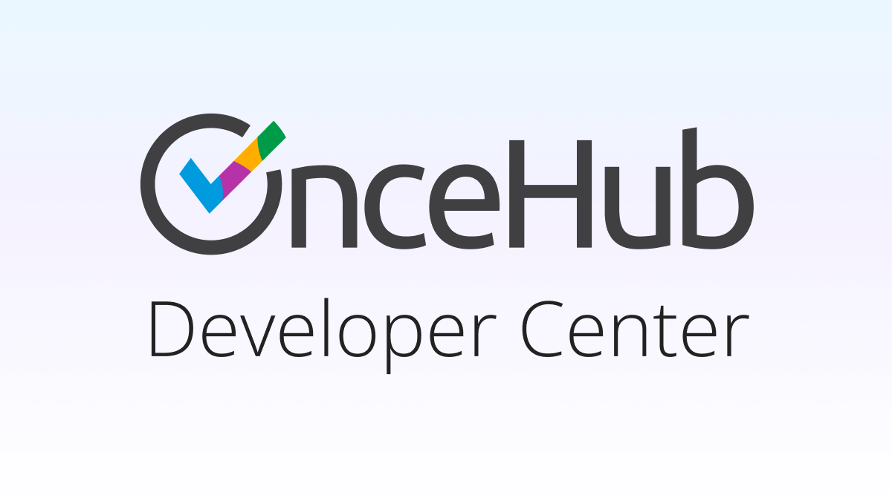

# OnceHub Developer Center



Official developer documentation for OnceHub APIs and integrations.

Visit the documentation at: [developers.oncehub.com](https://developers.oncehub.com)

## Contributing

This site is built using [Docusaurus](https://docusaurus.io/) and [Scalar](https://scalar.com/) for API reference documentation.

### Local Development

```bash
npm install
npm run dev
```

The `dev` script runs:

- Docusaurus development server with hot reload
- OpenAPI build watcher for specification changes

**Note:** Docusaurus content changes are hot-reloaded automatically. OpenAPI specification changes require a manual browser reload.

**Important:** When modifying the OpenAPI specification files in `/openapi`, the build script generates variant files (JSON/YAML) in the `/static` folder. These auto-generated files must be committed to Git as Scalar serves them directly from the static folder.

### Build

```bash
npm run build
```

### Testing

Run code quality checks:

```bash
npm test
```

This runs:

- Prettier code formatting check
- OpenAPI specification validation

## License

Documentation content is © OnceHub.
